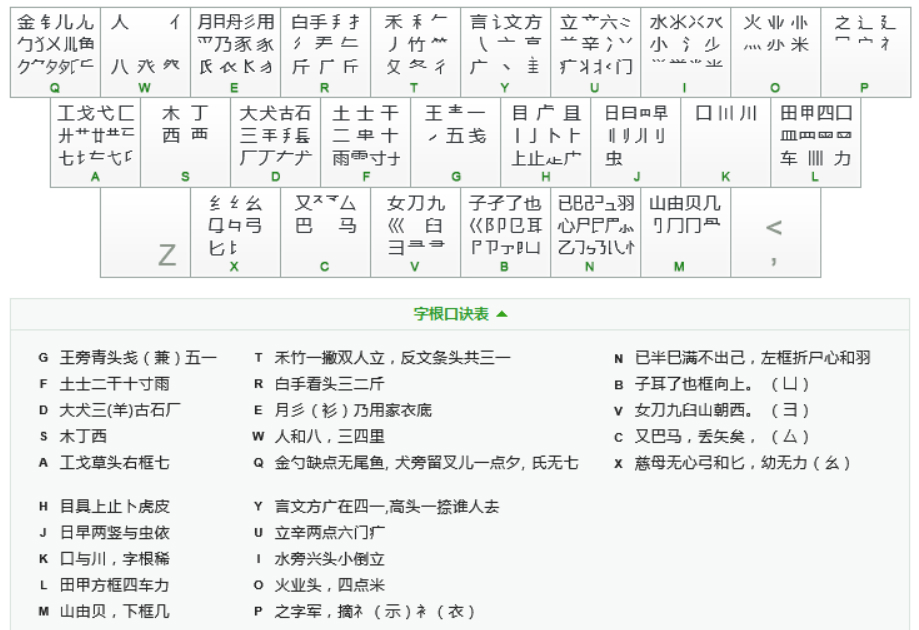

# :sparkles:输入法:sparkles:

- [x] 切换:alt + shift
- [x] 五码上屏
- [x] `空格` `;` `‘`分别代表1,2,3候选
- [x] z键上屏上次上屏内容
- [x] `[` `]`前后翻页

# :sparkles:86五笔字根表(sougou):sparkles:

# :sparkles:86五笔编码规则:sparkles:
> 注:带()的部分为合理扩展内容,意味着向下兼容原版

* 识别码 
字结构可以分为`左右型` `上下型` `杂合型`
取最后一笔所在区的结构对应按键为识别码

||左右|上下|杂合|
|-|-|-|-|
|横|g|f|d|
|竖|h|j|k|
|撇|t|r|e|
|捺|y|u|i|
|折|n|b|v|

* 字 

|一般字|成字字根|键名字|笔画字|
|-|-|-|-|
|每次取主观上 最大的字根 3码未取完 取末笔识别码|输入所在位置后, 加上笔画 3码未完 取末笔画|1简2号或 输入4次所在位置|ggll hhll ttll yyll nnll|

* 词

|二字|三字|多字|
|-|-|-|
|(每字的前1码) 或 每字的前2码|(每字的前1码) 或 每字的前1码最后一字取2码|每字的前1码最后一字取2码|

# :sparkles:词库:sparkles:
## :star2:1码:star2:
* 1简1号

|一|地|在|要|工|
|-|-|-|-|-|
|上|是|中|国|同|
|和|的|有|人|我|
|主|产|不|为|这|
|民|了|发|以|经|

* 1简2号(键名字)

|王|土|大|木|藏(工a)|
|-|-|-|-|-|
|目|日|口|田|山|
|禾|白|月|您(人w)|金|
|言|着(立uu)|水|火|之|
|已|子|女|又|纟|

## :star2:2码:star2:
> 2简1通常为字
> 2简2通常为2字词

|aa,1=式|ab,1=节|ac,1=芭|ad,1=基|ae,1=菜|af,1=革|ag,1=七|
|-|-|-|-|-|-|-|
|aa,2=工艺|ab,2=获取|ac,2=功能|ad,2=基础|ae,2=七彩|af,2=或者|ag,2=甚至|
|ah,1=牙|ai,1=东|aj,1=划|ak,1=或|al,1=功|am,1=贡|an,1=世|ao,1=蒌|
|ah,2=项目|ai,2=欧洲|aj,2=或是|ak,2=区别|al,2=世界|am,2=共同|an,2=恐惧|ao,2=工业|
|ap,1=芝|aq,1=区|ar,1=匠|as,1=蘸|at,1=攻|au,1=燕|av,1=切|aw,1=共|
|ap,2=其实|aq,2=著名|ar,2=落后|as,2=基本|at,2=获得|au,2=期间|av,2=共建|aw,2=其他|
|ax,1=药|ay,1=芳|ba,1=陈|bb,1=子|bc,1=取|bd,1=承|be,1=阴|bf,1=际|
|ax,2=花费|ay,2=英语|ba,2=防范|bb,2=孩子|bc,2=出台|bd,2=障碍|be,2=承受|bf,2=出去|
|bg,1=卫|bh,1=耻|bi,1=孙|bj,1=阳|bk,1=职|bl,1=阵|bm,1=出|bn,1=也|
|bg,2=出来|bh,2=防止|bi,2=取消|bj,2=随时|bk,2=出口|bl,2=承办|bm,2=耳朵|bn,2=出发|
|bo,1=耿|bp,1=辽|bq,1=隐|br,1=孤|bs,1=阿|bt,1=降|bu,1=联|bv,1=限|
|bo,2=职业|bp,2=卫视|bq,2=孤独|br,2=附近|bs,2=院校|bt,2=联系|bu,2=随着|bv,2=阿姨|
|bw,1=队|bx,1=陛|by,1=防|ca,1=戏|cb,1=予|cc,1=双|cd,1=参|ce,1=能|
|bw,2=阶段|bx,2=陆续|by,2=承认|ca,2=艰苦|cb,2=骗子|cc,2=艰难|cd,2=对面|ce,2=通用|
|cf,1=对|cg,1=骊|ch,1=对此|ci,1=预测|cj,1=骒|ck,1=台|cl,1=劝|cm,1=观|
|cf,2=通过|cg,2=对于|ch,2=马上|ci,2=通常|cj,2=能量|ck,2=马路|cl,2=参加|cm,2=戏曲|
|cn,1=马|co,1=预料|cp,1=驼|cq,1=允|cr,1=牟|cs,1=骠|ct,1=矣|cu,1=骈|
|cn,2=难以|co,2=台灯|cp,2=观察|cq,2=能够|cr,2=矛盾|cs,2=颈椎|ct,2=通知|cu,2=难道|
|cv,1=艰|cw,1=难|cx,1=柔弱|cy,1=骗|da,1=左|db,1=顾|dc,1=友|dd,1=大|
|cv,2=难忍|cw,2=观众|cx,2=预约|cy,2=对方|da,2=成功|db,2=太阳|dc,2=面对|dd,2=存在|
|de,1=胡|df,1=夺|dg,1=三|dh,1=丰|di,1=砂|dj,1=百|dk,1=右|dl,1=历|
|de,2=而且|df,2=成都|dg,2=故事|dh,2=有些|di,2=非常|dj,2=而是|dk,2=历史|dl,2=原因|
|dm,1=面|dn,1=成|do,1=灰|dp,1=达|dq,1=克|dr,1=原|ds,1=厅|dt,1=帮|
|dm,2=原则|dn,2=而已|do,2=厘米|dp,2=大家|dq,2=大多|dr,2=有所|ds,2=成本|dt,2=成长|
|du,1=碰|dv,1=肆|dw,1=春|dx,1=龙|dy,1=太|ea,1=肛|eb,1=服|ec,1=肥|
|du,2=有关|dv,2=原始|dw,2=有人|dx,2=大约|dy,2=成为|ea,2=及其|eb,2=采取|ec,2=受骗|
|ed,1=须|ee,1=朋|ef,1=肝|eg,1=且|eh,1=鼐|ei,1=膛|ej,1=胆|ek,1=肿|
|ed,2=朋友|ee,2=采用|ef,2=县城|eg,2=受到|eh,2=逐步|ei,2=逐渐|ej,2=及时|ek,2=用品|
|el,1=肋|em,1=肌|en,1=甩|eo,1=膦|ep,1=爱|eq,1=胸|er,1=遥|es,1=采|
|el,2=助力|em,2=肌肉|en,2=爱情|eo,2=用料|ep,2=胸襟|eq,2=彩色|er,2=爱护|es,2=股票|
|et,1=用|eu,1=胶|ev,1=妥|ew,1=脸|ex,1=脂|ey,1=及|fa,1=载|fb,1=地|
|et,2=服务|eu,2=服装|ev,2=爱好|ew,2=月份|ex,2=彩绘|ey,2=用户|fa,2=规划|fb,2=无限|
|fc,1=去|fd,1=城|fe,1=圾|ff,1=寺|fg,1=二|fh,1=直|fi,1=示|fj,1=井|
|fc,2=云|fd,2=鼓励|fe,2=喜爱|ff,2=运动|fg,2=起来|fh,2=考虑|fi,2=无法|fj,2=都是|
|fk,1=吉|fl,1=协|fm,1=南|fn,1=场|fo,1=赤|fp,1=过|fq,1=元|fr,1=垢|
|fk,2=封口|fl,2=增加|fm,2=规则|fn,2=赶快|fo,2=专业|fp,2=规定|fq,2=无|fr,2=直接|
|fs,1=霜|ft,1=才|fu,1=增|fv,1=雪|fw,1=夫|fx,1=坳|fy,1=坟|ga,1=开|
|fs,2=需要|ft,2=都|fu,2=培养|fv,2=喜好|fw,2=动作|fx,2=增强|fy,2=城市|ga,2=形式|
|gb,1=顿|gc,1=到|gd,1=天|ge,1=表|gf,1=于|gg,1=五|gh,1=下|gi,1=不|
|gb,2=下降|gc,2=不能|gd,2=现在|ge,2=不用|gf,2=一起|gg,2=表现|gh,2=一些|gi,2=正常|
|gj,1=理|gk,1=事|gl,1=画|gm,1=现|gn,1=与|go,1=来|gp,1=琛|gq,1=列|
|gj,2=不是|gk,2=不足|gl,2=更加|gm,2=理由|gn,2=事情|go,2=不断|gp,2=一定|gq,2=理解|
|gr,1=珠|gs,1=末|gt,1=玫|gu,1=平|gv,1=妻|gw,1=珍|gx,1=毒|gy,1=玉|
|gr,2=青年|gs,2=不要|gt,2=一种|gu,2=再次|gv,2=开始|gw,2=不会|gx,2=班级|gy,2=到底|
|ha,1=虚|hb,1=眲|hc,1=皮|hd,1=瞭|he,1=肯|hf,1=歧|hg,1=凸|hh,1=止|
|ha,2=此项|hb,2=桌子|hc,2=步骤|hd,2=具有|he,2=皮肤|hf,2=点击|hg,2=上班|hh,2=眼睛|
|hi,1=步|hj,1=旧|hk,1=占|hl,1=卤|hm,1=贞|hn,1=鼎|ho,1=眯|hp,1=瞎|
|hi,2=睡觉|hj,2=此时|hk,2=眼中|hl,2=战略|hm,2=上网|hn,2=点心|ho,2=点燃|hp,2=肯定|
|hq,1=餐|hr,1=睥|hs,1=盯|ht,1=睡|hu,1=瞳|hv,1=眼|hw,1=具|hx,1=此|
|hq,2=此外|hr,2=目的|hs,2=目标|ht,2=具备|hu,2=目前|hv,2=目录|hw,2=具体|hx,2=上线|
|hy,1=眩|ia,1=江|ib,1=池|ic,1=汉|id,1=尖|ie,1=肖|if,1=汗|ig,1=汪|
|hy,2=上方|ia,2=小区|ib,2=演出|ic,2=沟通|id,2=没有|ie,2=涉及|if,2=活动|ig,2=水平|
|ih,1=小|ii,1=水|ij,1=浊|ik,1=溃|il,1=渐|im,1=没|in,1=沁|io,1=淡|
|ih,2=海上|ii,2=渐渐|ij,2=小时|ik,2=满足|il,2=沉默|im,2=常见|in,2=学习|io,2=辉煌|
|ip,1=常|iq,1=光|ir,1=泊|is,1=洒|it,1=少|iu,1=滚|iv,1=当|iw,1=兴|
|ip,2=游客|iq,2=当然|ir,2=掌握|is,2=学校|it,2=觉得|iu,2=注意|iv,2=少女|iw,2=学会|
|ix,1=涨|iy,1=游|ja,1=虹|jb,1=最|jc,1=紧|jd,1=晨|je,1=明|jf,1=时|
|ix,2=消费|iy,2=测试|ja,2=时期|jb,2=日子|jc,2=畅通|jd,2=里面|je,2=电脑|jf,2=显示|
|jg,1=量|jh,1=早|ji,1=晃|jj,1=昌|jk,1=蝇|jl,1=曙|jm,1=遇|jn,1=电|
|jg,2=是否|jh,2=早餐|ji,2=时尚|jj,2=明显|jk,2=影响|jl,2=暴力|jm,2=遇见|jn,2=早已|
|jo,1=显|jp,1=晕|jq,1=晚|jr,1=昕|js,1=果|jt,1=昨|ju,1=暗|jv,1=归|
|jo,2=果断|jp,2=电视|jq,2=最多|jr,2=最后|js,2=题材|jt,2=照片|ju,2=时间|jv,2=最好|
|jw,1=蛤|jx,1=曳|jy,1=影|ka,1=呀|kb,1=啊|kc,1=吧|kd,1=喊|ke,1=吸|
|jw,2=时候|jx,2=最终|jy,2=电话|ka,2=员工|kb,2=跟随|kc,2=嘴巴|kd,2=只有|ke,2=口腔|
|kf,1=叶|kg,1=呈|kh,1=嘴|ki,1=吵|kj,1=虽|kk,1=哭|kl,1=另|km,1=员|
|kf,2=患者|kg,2=唯一|kh,2=哪些|ki,2=品尝|kj,2=哪里|kk,2=呼吸|kl,2=中国|km,2=中央|
|kn,1=叫|ko,1=噗|kp,1=喧|kq,1=史|kr,1=听|ks,1=呆|kt,1=吃|ku,1=咬|
|kn,2=吸收|ko,2=吸烟|kp,2=踏实|kq,2=虽然|kr,2=品质|ks,2=只要|kt,2=品牌|ku,2=味道|
|kv,1=哪|kw,1=只|kx,1=哟|ky,1=嘛|la,1=轼|lb,1=囝|lc,1=轻|ld,1=因|
|kv,2=只好|kw,2=别人|kx,2=吸引|ky,2=距离|la,2=加工|lb,2=团队|lc,2=困难|ld,2=加大|
|le,1=胃|lf,1=轩|lg,1=车|lh,1=四|li,1=输光|lj,1=辊|lk,1=加|ll,1=男|
|le,2=辅助|lf,2=思考|lg,2=办理|lh,2=因此|li,2=办法|lj,2=力量|lk,2=思路|ll,2=默默|
|lm,1=轴|ln,1=思|lo,1=辚|lp,1=边|lq,1=罗|lr,1=斩|ls,1=困|lt,1=力|
|lm,2=国内|ln,2=加快|lo,2=置业|lp,2=国家|lq,2=国外|lr,2=连接|ls,2=轻松|lt,2=回复|
|lu,1=较|lv,1=轨|lw,1=办|lx,1=累|ly,1=罚|ma,1=曲|mb,1=邮|mc,1=凤|
|lu,2=车站|lv,2=男女|lw,2=男人|lx,2=加强|ly,2=因为|ma,2=周期|mb,2=删除|mc,2=赋予|
|md,1=央|me,1=骨|mf,1=周|mg,1=贱|mh,1=由|mi,1=峭|mj,1=则|mk,1=迥|
|md,2=网友|me,2=岁月|mf,2=网址|mg,2=由于|mh,2=同步|mi,2=同学|mj,2=同时|mk,2=账号|
|ml,1=崽|mm,1=删|mn,1=岂|mo,1=嶙|mp,1=迪|mq,1=风|mr,1=贩|ms,1=朵|
|ml,2=周围|mm,2=刚刚|mn,2=购买|mo,2=同类|mp,2=内容|mq,2=赚钱|mr,2=周年|ms,2=风格|
|mt,1=败|mu,1=赚|mv,1=内建|mw,1=内|mx,1=嶷|my,1=凡|na,1=懂|nb,1=敢|
|mt,2=购物|mu,2=网站|mv,2=刚好|mw,2=岗位|mx,2=网络|my,2=账户|na,2=收藏|nb,2=发出|
|nc,1=惨|nd,1=居|ne,1=以及|nf,1=导|ng,1=懒|nh,1=收|ni,1=悄|nj,1=慢|
|nc,2=性能|nd,2=发布|ne,2=必须|nf,2=展示|ng,2=发现|nh,2=以上|ni,2=书法|nj,2=展览|
|nk,1=避|nl,1=惭|nm,1=届|nn,1=忆|no,1=屎|np,1=惋|nq,1=懈|nr,1=怕|
|nk,2=性别|nl,2=发团|nm,2=以内|nn,2=习惯|no,2=发烧|np,2=书写|nq,2=避免|nr,2=以后|
|ns,1=怵|nt,1=必|nu,1=习|nv,1=恨|nw,1=戳|nx,1=惯|ny,1=心|oa,1=烧|
|ns,2=性格|nt,2=发生|nu,2=情况|nv,2=愤怒|nw,2=收集|nx,2=习惯|ny,2=改变|oa,2=迷茫|
|ob,1=籽|oc,1=粑|od,1=类|oe,1=粗|of,1=灶|og,1=业|oh,1=粘|oi,1=炒|
|ob,2=精子|oc,2=精通|od,2=数码|oe,2=精彩|of,2=灯塔|og,2=类型|oh,2=粘上|oi,2=数学|
|oj,1=烛|ok,1=燥|ol,1=烟|om,1=灿|on,1=断|oo,1=炎|op,1=迷|oq,1=燃|
|oj,2=数量|ok,2=精品|ol,2=精力|om,2=精髓|on,2=烦恼|oo,2=烧烤|op,2=精神|oq,2=火锅|
|or,1=煌|os,1=灯|ot,1=炸|ou,1=烂|ov,1=娄|ow,1=粉|ox,1=糨|oy,1=米|
|or,2=数据|os,2=炫酷|ot,2=精选|ou,2=精准|ov,2=精灵|ow,2=类似|ox,2=粉丝|oy,2=业主|
|pa,1=宽|pb,1=字|pc,1=寄予|pd,1=害|pe,1=家|pf,1=守|pg,1=写|ph,1=寂|
|pa,2=定期|pb,2=实际|pc,2=实验|pd,2=完成|pe,2=客服|pf,2=穿越|pg,2=实现|ph,2=视频|
|pi,1=宵|pj,1=审|pk,1=宫|pl,1=军|pm,1=宙|pn,1=密|po,1=灾|pp,1=之|
|pi,2=视觉|pj,2=容易|pk,2=实践|pl,2=实力|pm,2=宝贝|pn,2=农民|po,2=农业|pp,2=宝宝|
|pq,1=冤|pr,1=牢|ps,1=宁|pt,1=额|pu,1=被|pv,1=安|pw,1=穿|px,1=它|
|pq,2=突然|pr,2=之后|ps,2=农村|pt,2=家长|pu,2=空间|pv,2=完好|pw,2=社会|px,2=家乡|
|py,1=神|qa,1=氏|qb,1=凶|qc,1=色|qd,1=然|qe,1=角|qf,1=针|qg,1=钱|
|py,2=家庭|qa,2=鲜花|qb,2=儿子|qc,2=针对|qd,2=然而|qe,2=色彩|qf,2=错过|qg,2=负责|
|qh,1=外|qi,1=乐|qj,1=象|qk,1=名|ql,1=甸|qm,1=负|qn,1=包|qo,1=炙|
|qh,2=多些|qi,2=多少|qj,2=贸易|qk,2=争吵|ql,2=犯罪|qm,2=猪肉|qn,2=金属|qo,2=锻炼|
|qp,1=锭|qq,1=多|qr,1=勿|qs,1=杀|qt,1=儿|qu,1=匀|qv,1=争|qw,1=欠|
|qp,2=名字|qq,2=印象|qr,2=包括|qs,2=名校|qt,2=独特|qu,2=解决|qv,2=犹如|qw,2=包含|
|qx,1=镪|qy,1=久|ra,1=找|rb,1=报|rc,1=反|rd,1=拜|re,1=扔|rf,1=持|
|qx,2=免费|qy,2=希望|ra,2=推荐|rb,2=提出|rc,2=技能|rd,2=所有|re,2=接受|rf,2=失去|
|rg,1=捕|rh,1=年|ri,1=朱|rj,1=提|rk,1=扣|rl,1=舞|rm,1=抽|rn,1=所|
|rg,2=看到|rh,2=年龄|ri,2=欣赏|rj,2=按照|rk,2=舞蹈|rl,2=魅力|rm,2=看见|rn,2=所以|
|ro,1=搂|rp,1=近|rq,1=换|rr,1=折|rs,1=打|rt,1=手|ru,1=拉|rv,1=扫|
|ro,2=指数|rp,2=制定|rq,2=报名|rr,2=看看|rs,2=技术|rt,2=提升|ru,2=投资|rv,2=搭建|
|rw,1=失|rx,1=揩|ry,1=扩|sa,1=横|sb,1=李|sc,1=权|sd,1=枯|se,1=极|
|rw,2=提供|rx,2=热线|ry,2=提高|sa,2=模式|sb,2=样子|sc,2=可能|sd,2=构成|se,2=可爱|
|sf,1=村|sg,1=本|sh,1=相|si,1=档|sj,1=查|sk,1=可|sl,1=楞|sm,1=机|
|sf,2=要求|sg,2=相互|sh,2=禁止|si,2=想法|sj,2=可是|sk,2=西路|sl,2=配置|sm,2=相同|
|sn,1=杨|so,1=杰|sp,1=榨|sq,1=攀|sr,1=析|ss,1=林|st,1=覆|su,1=样|
|sn,2=可以|so,2=材料|sp,2=西安|sq,2=想象|sr,2=根据|ss,2=想想|st,2=本身|su,2=标准|
|sv,1=要|sw,1=检|sx,1=楷|sy,1=术|ta,1=长|tb,1=季|tc,1=么|td,1=矢|
|sv,2=构建|sw,2=相信|sx,2=相比|sy,2=杭州|ta,2=长期|tb,2=种子|tc,2=智能|td,2=造成|
|te,1=秀|tf,1=行|tg,1=生|th,1=处|ti,1=秒|tj,1=得|tk,1=各|tl,1=务|
|te,2=利用|tf,2=行动|tg,2=得到|th,2=重点|ti,2=生活|tj,2=待遇|tk,2=特别|tl,2=我国|
|tm,1=向|tn,1=秘|to,1=秋|tp,1=管|tq,1=称|tr,1=物|ts,1=条|tt,1=笔|
|tm,2=自由|tn,2=自己|to,2=行业|tp,2=稳定|tq,2=很多|tr,2=选择|ts,2=重要|tt,2=怎么|
|tu,1=剩|tv,1=委|tw,1=答|tx,1=第|ty,1=入|ua,1=并|ub,1=闻|uc,1=冯|
|tu,2=知道|tv,2=复杂|tw,2=我们|tx,2=系统|ty,2=知识|ua,2=辛苦|ub,2=亲子|uc,2=普通|
|ud,1=关|ue,1=前|uf,1=半|ug,1=闰|uh,1=站|ui,1=冰|uj,1=间|uk,1=问|
|ud,2=状态|ue,2=并且|uf,2=养老|ug,2=美丽|uh,2=道具|ui,2=交流|uj,2=问题|uk,2=产品|
|ul,1=曾|um,1=商|un,1=闷|uo,1=普|up,1=帝|uq,1=交|ur,1=瓣|us,1=亲|
|ul,2=意思|um,2=意见|un,2=首届|uo,2=产业|up,2=决定|uq,2=音乐|ur,2=背后|us,2=美术|
|ut,1=道|uu,1=立|uv,1=妆|uw,1=闪|ux,1=北|uy,1=六|va,1=毁|vb,1=好|
|ut,2=准备|uu,2=新闻|uv,2=立即|uw,2=单位|ux,2=曾经|uy,2=阅读|va,2=如期|vb,2=女子|
|vc,1=妈|vd,1=姑|ve,1=奶|vf,1=寻|vg,1=嫩|vh,1=叟|vi,1=录|vj,1=旭|
|vc,2=嬉戏|vd,2=好友|ve,2=忍受|vf,2=女士|vg,2=召开|vh,2=那些|vi,2=灵活|vj,2=如果|
|vk,1=如|vl,1=舅|vm,1=妯|vn,1=鼠|vo,1=灵|vp,1=巡|vq,1=婚|vr,1=婢|
|vk,2=好吃|vl,2=努力|vm,2=如同|vn,2=女性|vo,2=奶粉|vp,2=婚礼|vq,2=女儿|vr,2=寻找|
|vs,1=杂|vt,1=群|vu,1=嫌|vv,1=妇|vw,1=臾|vx,1=姆|vy,1=妨|wa,1=代|
|vs,2=那样|vt,2=那么|vu,2=建立|vv,2=姐姐|vw,2=如何|vx,2=始终|vy,2=建议|wa,2=公共|
|wb,1=他|wc,1=公|wd,1=估|we,1=仍|wf,1=仁|wg,1=全|wh,1=个|wi,1=偿|
|wb,2=保险|wc,2=体验|wd,2=全面|we,2=使用|wf,2=人才|wg,2=今天|wh,2=从此|wi,2=全省|
|wj,1=介|wk,1=保|wl,1=佃|wm,1=仙|wn,1=亿|wo,1=伙|wp,1=侬|wq,1=你|
|wj,2=但是|wk,2=作品|wl,2=全国|wm,2=合同|wn,2=公司|wo,2=企业|wp,2=人家|wq,2=分钟|
|wr,1=伯|ws,1=休|wt,1=作|wu,1=们|wv,1=分|ww,1=从|wx,1=化|wy,1=信|
|wr,2=今年|ws,2=分析|wt,2=什么|wu,2=创新|wv,2=你好|ww,2=他们|wx,2=传统|wy,2=作为|
|xa,1=红|xb,1=弛|xc,1=弘|xd,1=绑|xe,1=级|xf,1=续|xg,1=线|xh,1=引|
|xa,2=细节|xb,2=继承|xc,2=经验|xd,2=经历|xe,2=费用|xf,2=经过|xg,2=结束|xh,2=终点|
|xi,1=纱|xj,1=旨|xk,1=绳|xl,1=细|xm,1=绸|xn,1=纪|xo,1=继|xp,1=缩|
|xi,2=经常|xj,2=结果|xk,2=线路|xl,2=比较|xm,2=经典|xn,2=练习|xo,2=毕业|xp,2=比赛|
|xq,1=约|xr,1=缴|xs,1=缥|xt,1=疑|xu,1=弱|xv,1=绿|xw,1=给|xx,1=比|
|xq,2=幼儿|xr,2=维护|xs,2=结构|xt,2=纳入|xu,2=母亲|xv,2=比如|xw,2=综合|xx,2=组织|
|xy,1=纺|ya,1=谋|yb,1=离|yc,1=诵|yd,1=庆|ye,1=衣|yf,1=计|yg,1=评|
|xy,2=强调|ya,2=方式|yb,2=为了|yc,2=应对|yd,2=方面|ye,2=享受|yf,2=永远|yg,2=调整|
|yh,1=让|yi,1=就|yj,1=齐|yk,1=训|yl,1=为|ym,1=高|yn,1=记|yo,1=变|
|yh,2=这些|yi,2=旅游|yj,2=就是|yk,2=识别|yl,2=设置|ym,2=高峰|yn,2=记忆|yo,2=麻烦|
|yp,1=这|yq,1=义|yr,1=亵|ys,1=床|yt,1=放|yu,1=说|yv,1=庸|yw,1=认|
|yp,2=方案|yq,2=许多|yr,2=广播|ys,2=这样|yt,2=熟悉|yu,2=文章|yv,2=记录|yw,2=就会|
|yx,1=率|yy,1=方|
|yx,2=训练|yy,2=文|

## :star2:3码:star2:
> 3简为3字词,少部分3长词可能只有3码没有全码,内容过多不展示;

## :star2:4码:star2:
> 4码为字或词,为占比最大的主体,内容过多不展示.

2025年6月20日04:28:38

Written by Vito Devlin:tada:

DevVitoP@outlook.com

